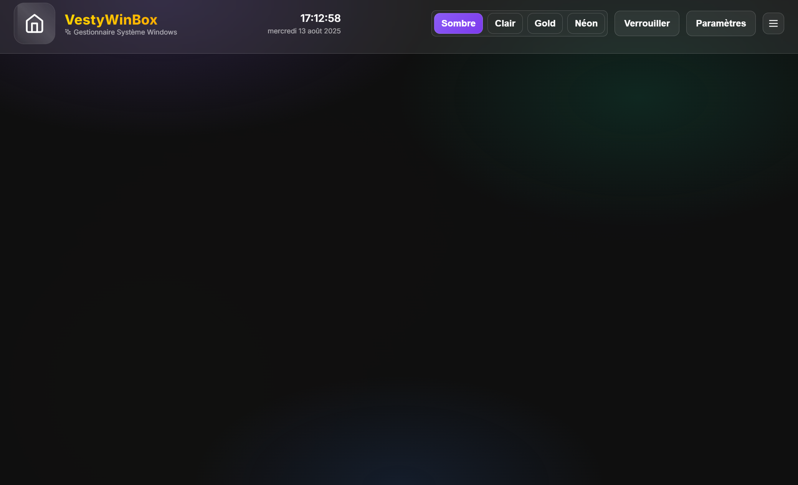
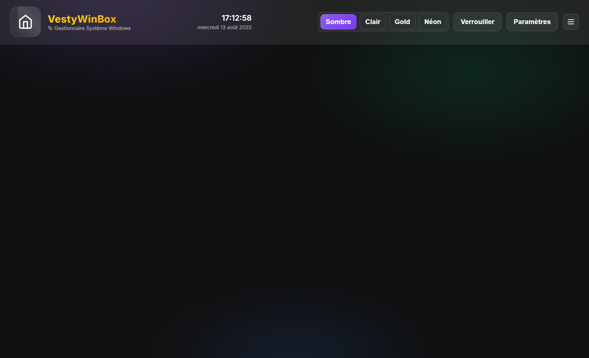
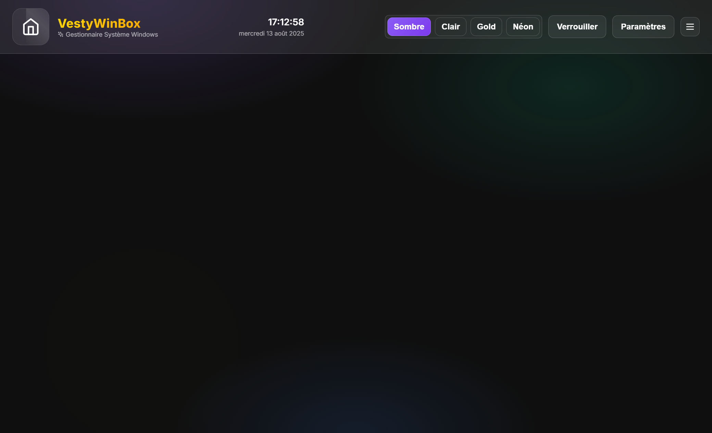
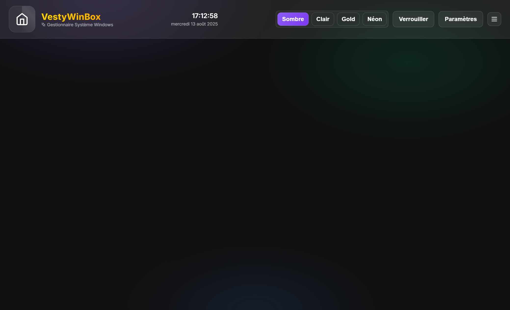

# VestyWinBox

Une boîte à outils moderne pour Windows (Electron + React) avec UI glassmorphism: gestion Chocolatey, apps portables, conversions de fichiers, et God Mode.

## Captures

- Dashboard
  - 
- Chocolatey
  - 
- Convertisseur
  - 
- God Mode
  - 

## Prérequis

- Windows 10+
- Node.js 18+
- Outils optionnels (détectés automatiquement pour le Convertisseur):
  - ffmpeg, ImageMagick (`magick`), 7‑Zip (`7z`), LibreOffice (`soffice`), Ghostscript (`gs`)

## Démarrer

```bash
npm i
npm run electron:dev
```

## Scripts utiles

- Dev Vite: `npm run dev`
- Electron (prod-like): `npm run electron`
- Build web: `npm run build`
- Build exécutable: `npm run build:exe`
- Lint / Typecheck: `npm run lint` / `npm run typecheck`
- Tests unitaires: `npm run test`
- E2E (Playwright): `npm run e2e`

## Fonctionnalités clés

- Chocolatey
  - Recherche avec filtres (exact/variants/prerelease/mainteneur)
  - Onglets installés/obsolètes/terminal
  - Réparer Chocolatey (élévation auto): enable source, upgrade chocolatey, install core.extension, clean, uninstall KB2919355/KB2919442
  - Terminal intégré avec exécution Admin et bouton « Réparer + Relancer »
- Convertisseur de fichiers
  - Images/vidéos/audio/docs/archives avec options avancées (CRF/preset/bitrate)
  - Badge “Outils manquants (n)” + bouton « Installer tout » (séquence réparations Chocolatey + install des outils manquants)
  - File de conversion, pause/reprendre/sauter, export des logs
- Apps Portables
  - Import `.exe`, options de lancement (args, CWD, admin, timeout), test CWD, cache d’icônes
- God Mode
  - BitLocker (status/enable/disable/clé), Windows Update (pause immédiate + planifiée), exclusions Defender
  - Outils système rapides (Observateur, Services, etc.) et journal exportable

## Dépannage Chocolatey (robuste)

Si vous rencontrez des erreurs NuGet/dépendances (KB anciennes, `chocolatey-core.extension` manquant, etc.), utilisez le bouton « Réparer Chocolatey ». Équivalent CLI:

```powershell
choco source enable -n=chocolatey
choco upgrade chocolatey -y --no-progress
choco install chocolatey-core.extension -y --no-progress
choco clean -y
choco cache remove --all
choco uninstall KB2919355 KB2919442 -y --force --no-progress
```

Ensuite, relancez l’installation.

## Troubleshooting (Playwright / TypeScript)

### Playwright (E2E)

- Installer/mettre à jour les navigateurs:
  - `npx playwright install`
  - Forcer la réinstallation: `npx playwright install --force`
- Debug interactif et traces:
  - `npx playwright test --headed --project=chromium --trace on`
  - `npx playwright show-report`
  - `PWDEBUG=1 npx playwright test` (ou `$env:PWDEBUG=1; npx playwright test` sous PowerShell)
- Démarrage serveur dev automatique pour les tests:
  - Exemple de config à ajouter dans `playwright.config.ts`:
    ```ts
    // playwright.config.ts
    import { defineConfig } from '@playwright/test'
    export default defineConfig({
      webServer: {
        command: 'npm run dev',
        port: 5173,
        reuseExistingServer: !process.env.CI,
        timeout: 120_000,
      },
      timeout: 60_000,
      expect: { timeout: 10_000 },
    })
    ```
- Proxy / réseau (si entreprise): définir `HTTP_PROXY`/`HTTPS_PROXY` avant `npx playwright install`.
- Cache Playwright corrompu (Windows): supprimer `%USERPROFILE%\AppData\Local\ms-playwright` puis réinstaller.

### TypeScript

- Types manquants (ex: React/Node):
  - `npm i -D typescript @types/node @types/react @types/react-dom`
- Références Vite/Node non trouvées: ajouter les types dans `tsconfig.json` ou fichier d’environnement.
  - Option 1 (tsconfig):
    ```json
    {
      "compilerOptions": {
        "types": ["node", "vite/client"]
      }
    }
    ```
  - Option 2 (fichier): créer `src/types/env.d.ts`:
    ```ts
    /// <reference types="vite/client" />
    ```
- Import d’actifs (PNG/SVG/etc.) non typés: créer `src/types/assets.d.ts`:
  ```ts
  declare module '*.png'
  declare module '*.jpg'
  declare module '*.jpeg'
  declare module '*.gif'
  declare module '*.svg' {
    import * as React from 'react'
    const content: React.FunctionComponent<React.SVGAttributes<SVGElement>>
    export default content
  }
  ```
- Élargir des globals (ex: `window.electron`): créer `src/types/global.d.ts`:
  ```ts
  declare global {
    interface Window {
      electron?: unknown
    }
  }
  export {}
  ```
- Exécuter la vérification de types: `npm run typecheck` (ou `tsc -p tsconfig.json --noEmit`).
- En cas d’anomalies de cache: supprimer `node_modules` et le cache Vite puis réinstaller:
  - PowerShell: `Remove-Item -Recurse -Force node_modules; Remove-Item -Recurse -Force .vite; npm i`

## Accessibilité & i18n

- ARIA, `role`, `aria-live`, focus visibles
- FR uniquement (via `t()`)

## Qualité & CI

- ESLint + Prettier + Vitest + Playwright
- CI: lint + build; Release: build NSIS/portable (GitHub Actions)

## Licence

Usage interne / expérimental
